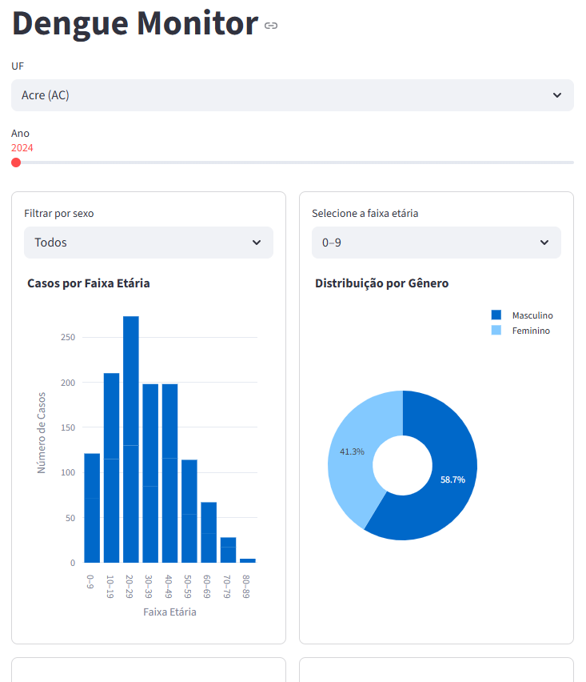
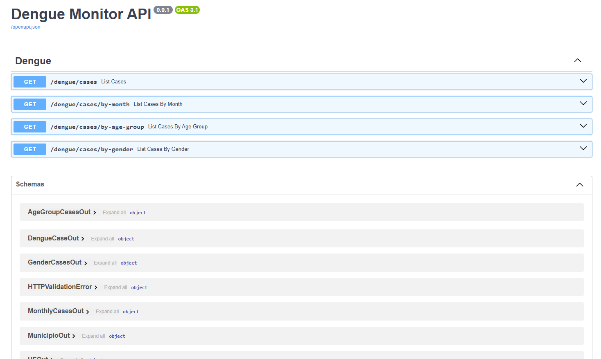

# 🦟 Dengue Monitor

**Dengue Monitor** is a data engineering and analytics project for analyzing dengue notification data in Brazil.

The project loads raw dengue CSV files, normalizes the data into PostgreSQL, creates materialized views for analytical queries, exposes a FastAPI API, and provides an interactive Streamlit dashboard for exploring epidemiological, geographic, and demographic patterns.

The main goal is to demonstrate practical skills in:

- Python data processing
- PostgreSQL data modeling
- SQLAlchemy and Alembic migrations
- Analytical API development with FastAPI
- Dashboard development with Streamlit and Plotly
- Query optimization with materialized views
- Reproducible local project setup

---

## Table of Contents

- [Project Overview](#project-overview)
- [Architecture](#architecture)
- [Technology Stack](#technology-stack)
- [Project Structure](#project-structure)
- [Prerequisites](#prerequisites)
- [Quick Start](#quick-start)
- [Database](#database)
- [Raw Data and Sampling](#raw-data-and-sampling)
- [API Examples](#api-examples)
- [Dashboard](#dashboard)
- [Screenshots](#screenshots)
- [Useful Commands](#useful-commands)
- [Troubleshooting](#troubleshooting)
- [Roadmap](#roadmap)
- [License](#license)
- [Author](#author)

---

## Project Overview

Dengue Monitor consolidates dengue notification records and allows users to analyze cases by:

- Epidemiological year
- State (`UF`)
- Municipality
- Month
- Age group
- Gender

The project is designed to keep local execution lightweight while still working with real public health datasets. By default, the ingestion pipeline applies stratified sampling before inserting records into PostgreSQL. See [Raw Data and Sampling](#raw-data-and-sampling) for details.

---

## Architecture

```text
┌──────────────────────┐
│ Raw Dengue CSV Files │
│ data/raw/DENGBR*.csv │
└──────────┬───────────┘
           │
           ▼
┌──────────────────────┐
│ Data Processing      │
│ data/process_data.py │
│ - chunked reading    │
│ - sampling           │
│ - normalization      │
└──────────┬───────────┘
           │
           ▼
┌──────────────────────────────┐
│ PostgreSQL                   │
│ - dengue_cases               │
│ - materialized views         │
└──────────┬───────────────────┘
           │
           ├─────────────────────────┐
           ▼                         ▼
┌──────────────────────┐   ┌────────────────────────┐
│ FastAPI              │   │ Streamlit Dashboard     │
│ api/routes.py        │   │ dashboard/app.py        │
│ Analytical endpoints │   │ Plotly visualizations   │
└──────────────────────┘   └────────────────────────┘
```

---

## Technology Stack

### Backend and Data

- Python 3.12+
- PostgreSQL
- SQLAlchemy
- Alembic
- Pandas

### API

- FastAPI
- Pydantic
- Uvicorn

### Dashboard and Visualization

- Streamlit
- Plotly
- Matplotlib
- Seaborn

### Database Optimization

- Materialized views
- Indexes
- Aggregated analytical queries

---

## Project Structure

```text
dengue-monitor/
│
├── alembic/
│   ├── versions/                    # Database migrations
│   ├── env.py
│   └── script.py.mako
│
├── api/
│   ├── services/
│   │   └── location_service.py       # UF and municipality translation helpers
│   ├── routes.py                     # FastAPI routes
│   ├── schemas.py                    # Pydantic response schemas
│   └── __init__.py
│
├── core/
│   ├── repositories/
│   │   └── dengue_repository.py      # Database query functions
│   ├── models.py                     # SQLAlchemy models
│   └── __init__.py
│
├── dashboard/
│   ├── app.py                        # Streamlit dashboard entrypoint
│   └── utils.py                      # Dashboard helper functions
│
├── data/
│   ├── lookups/
│   │   ├── loader.py                 # Lookup loader helpers
│   │   ├── municipios.json           # Municipality lookup data
│   │   └── ufs.json                  # Brazilian states lookup data
│   ├── raw/                          # Raw CSV files, not versioned
│   ├── transformers/
│   │   └── age.py                    # Age parsing and normalization
│   ├── analysis.py                   # Dashboard analytical queries
│   ├── enums.py
│   ├── process_data.py               # CSV ingestion and normalization pipeline
│   └── __init__.py
│
├── infra/
│   ├── config.py                     # Environment-based settings
│   ├── database.py                   # SQLAlchemy engine/session setup
│   ├── formatter.py                  # Logging formatter
│   └── logging.py                    # Logging setup
│
├── scripts/
│   └── database/
│       └── refresh_materialized_views.sql
│
├── visualization/
│   ├── matplotlib.py
│   ├── plotly.py
│   ├── seaborn.py
│   └── __init__.py
│
├── main.py                           # FastAPI application entrypoint
├── alembic.ini
├── .env.example
├── .gitignore
├── requirements.txt
└── README.md
```

> Local-only folders and files such as `venv/`, `.env`, `logs/`, `__pycache__/`, and raw CSV files should not be committed to version control.

---

## Prerequisites

Before running the project, make sure you have:

- Python 3.12 or later
- PostgreSQL installed and running
- Git
- `psql` command-line client
- Raw dengue CSV files placed inside `data/raw/`

Recommended:

- A clean Python virtual environment
- A PostgreSQL user with permission to create tables, indexes, and materialized views

---

## Quick Start

Run all commands from the **project root** unless stated otherwise.

### 1. Clone the repository

```bash
git clone https://github.com/my-python-projects/dengue-monitor.git
cd dengue-monitor
```

### 2. Create and activate a virtual environment

Linux/macOS:

```bash
python -m venv venv
source venv/bin/activate
```

Windows PowerShell:

```powershell
python -m venv venv
venv\Scripts\Activate.ps1
```

### 3. Install dependencies

```bash
pip install -r requirements.txt
```

> The application builds the database URL using `postgresql+psycopg://...`, so the environment must include a PostgreSQL driver compatible with this SQLAlchemy URL.

### 4. Configure environment variables

Create a local `.env` file from `.env.example`:

```bash
cp .env.example .env
```

Windows PowerShell:

```powershell
Copy-Item .env.example .env
```

Then update the database credentials:

```env
APP_NAME=Dengue Monitor
ENV=development

LOG_LEVEL=INFO
LOG_FORMAT=TEXT
LOG_TO_FILE=true
LOG_DIR=logs

DB_HOST=localhost
DB_PORT=5432
DB_NAME=dengue_db
DB_USER=dengue_user
DB_PASSWORD=your_password

OPENDATASUS_BASE_URL=https://apidadosabertos.saude.gov.br/arboviroses/dengue
API_PAGE_SIZE=1000
```

> Do not commit your `.env` file. Keep only `.env.example` in the repository.

### 5. Create the PostgreSQL database

Connect to PostgreSQL using an admin user:

```bash
psql -U postgres
```

Then run:

```sql
CREATE DATABASE dengue_db;
CREATE USER dengue_user WITH PASSWORD 'your_password';
GRANT ALL PRIVILEGES ON DATABASE dengue_db TO dengue_user;
```

If your PostgreSQL version requires explicit schema privileges, connect to the database and run:

```sql
\c dengue_db
GRANT USAGE, CREATE ON SCHEMA public TO dengue_user;
```

If you prefer to use an existing PostgreSQL user, create only the database and configure `.env` accordingly.

### 6. Run database migrations

```bash
alembic upgrade head
```

This creates the main table, indexes, and materialized views used by the project.

### 7. Add raw dengue CSV files

Create the raw data folder if it does not exist:

```bash
mkdir -p data/raw
```

Windows PowerShell:

```powershell
New-Item -ItemType Directory -Force data/raw
```

Place files such as the following inside `data/raw/`:

```text
data/raw/DENGBR24.csv
data/raw/DENGBR25.csv
```

The pipeline looks for files matching:

```text
DENGBR*.csv
```

You can obtain the raw files from the Brazilian Health Open Data Portal:

```text
https://dadosabertos.saude.gov.br/dataset/arboviroses-dengue
```

### 8. Process and load the data

Run this command from the **project root**, not from inside the `data/` folder:

```bash
python -m data.process_data
```

This command reads the CSV files, applies sampling, normalizes selected fields, and inserts the processed records into PostgreSQL.

### 9. Refresh materialized views

After loading or changing data, refresh the materialized views:

```bash
psql -d dengue_db -f scripts/database/refresh_materialized_views.sql
```

If your database requires user/host options:

```bash
psql -h localhost -U dengue_user -d dengue_db -f scripts/database/refresh_materialized_views.sql
```

### 10. Run the API and dashboard

Start the API:

```bash
uvicorn main:app --reload
```

Open the API documentation:

```text
http://127.0.0.1:8000/docs
```

In another terminal, with the virtual environment activated, start the dashboard:

```bash
streamlit run dashboard/app.py
```

Open:

```text
http://localhost:8501
```

---

## Database

### Main table

The main table is:

```text
dengue_cases
```

It stores normalized dengue notification records.

Important columns:

| Column | Description |
|---|---|
| `nu_ano` | Epidemiological year |
| `sg_uf_not` | Reporting state code |
| `id_municip` | Municipality code |
| `dt_notific` | Notification date |
| `idade` | Normalized patient age |
| `idade_unidade` | Age unit after parsing |
| `cs_sexo` | Gender code |

### Materialized views

The project uses materialized views to speed up dashboard analytics.

| View | Purpose |
|---|---|
| `mv_cases_by_age_group` | Cases grouped by year, state, gender, and age range |
| `mv_cases_by_gender_age_group` | Cases grouped by gender and age range |
| `mv_top_municipios` | Total cases by municipality |
| `mv_cases_heatmap_month_age` | Cases by month and age range for heatmap visualization |

Materialized views are created by Alembic migrations and refreshed with:

```bash
psql -d dengue_db -f scripts/database/refresh_materialized_views.sql
```

> Refresh the materialized views every time new data is loaded into `dengue_cases`.

---

## Raw Data and Sampling

Raw CSV files are not versioned because they can be large.

Expected location:

```text
data/raw/
```

Expected filename pattern:

```text
DENGBR*.csv
```

Example:

```text
data/raw/DENGBR24.csv
data/raw/DENGBR25.csv
```

By default, the ingestion pipeline applies **stratified sampling** using this grouping:

```text
UF + epidemiological year + month
```

The default limit is:

```text
100 records per UF/year/month group
```

This behavior is defined in:

```python
run_pipeline(csv_path: str, max_per_group: int = 100)
```

Because sampling is enabled by default, the database does not necessarily contain all records from the original CSV files. This keeps local execution lighter and makes the dashboard easier to run on a personal machine.

For full-volume analysis, adjust or remove the sampling logic in `data/process_data.py` and make sure PostgreSQL has enough resources for the full dataset.

---

## API Examples

Start the API server before running the examples:

```bash
uvicorn main:app --reload
```

Base URL:

```text
http://127.0.0.1:8000
```

Interactive API documentation:

```text
http://127.0.0.1:8000/docs
```

### List dengue cases by state and year

```http
GET /dengue/cases?uf=MG&ano=2024
```

Example with month filter:

```http
GET /dengue/cases?uf=MG&ano=2024&mes=1
```

Example response:

```json
[
  {
    "ano": 2024,
    "uf": {
      "id": 31,
      "sigla": "MG",
      "nome": "Minas Gerais"
    },
    "municipio": {
      "codigo": 310620,
      "nome": "Belo Horizonte"
    },
    "casos": 123
  }
]
```

### Cases by month

```http
GET /dengue/cases/by-month?uf=MG&ano=2024
```

Example response:

```json
[
  { "mes": 1, "casos": 150 },
  { "mes": 2, "casos": 230 },
  { "mes": 3, "casos": 310 }
]
```

### Cases by age group

```http
GET /dengue/cases/by-age-group?uf=MG&ano=2024&mes=1
```

Example response:

```json
[
  { "faixa_etaria": "0-9", "casos": 15 },
  { "faixa_etaria": "10-19", "casos": 42 },
  { "faixa_etaria": "20-29", "casos": 67 }
]
```

### Cases by gender

```http
GET /dengue/cases/by-gender?uf=MG&ano=2024
```

Example with month filter:

```http
GET /dengue/cases/by-gender?uf=MG&ano=2024&mes=1
```

Example response:

```json
{
  "masculino": 120,
  "feminino": 150,
  "ignorado": 5
}
```

---

## Dashboard

Run the dashboard with:

```bash
streamlit run dashboard/app.py
```

The dashboard provides interactive visualizations for:

- Cases by age group
- Cases by gender
- Top municipalities by number of cases
- Heatmap by month and age group

The dashboard uses cached analytical queries and materialized views to reduce repeated database work.

---

## Screenshots

### Dashboard overview



---

### API documentation


---

## Useful Commands

### Run migrations

```bash
alembic upgrade head
```

### Roll back the latest migration

```bash
alembic downgrade -1
```

### Process raw CSV files

```bash
python -m data.process_data
```

### Refresh materialized views

```bash
psql -d dengue_db -f scripts/database/refresh_materialized_views.sql
```

### Run API

```bash
uvicorn main:app --reload
```

### Run dashboard

```bash
streamlit run dashboard/app.py
```

### Check Python syntax

```bash
python -m compileall .
```

---

## Troubleshooting

### `ModuleNotFoundError`

Make sure you are running commands from the project root and that the virtual environment is activated.

Correct:

```bash
python -m data.process_data
```

from:

```text
dengue-monitor/
```

Avoid running this command from inside the `data/` folder.

### Database connection error

Check your `.env` database values and confirm that PostgreSQL is running and that the database exists.

### Permission error when running migrations

Make sure your PostgreSQL user has privileges on the database and public schema:

```sql
GRANT ALL PRIVILEGES ON DATABASE dengue_db TO dengue_user;
GRANT USAGE, CREATE ON SCHEMA public TO dengue_user;
```

### Materialized views return no data

After loading CSV files, refresh the materialized views:

```bash
psql -d dengue_db -f scripts/database/refresh_materialized_views.sql
```

### Raw CSV files not found

Make sure the files are inside `data/raw/` and follow the expected `DENGBR*.csv` pattern.

---

## Roadmap

Planned improvements:

- Add automated tests
- Add Docker and Docker Compose
- Improve analytical query consistency with materialized views
- Review logging configuration
- Standardize project language, naming, and code organization

---

## License

This project is distributed under the MIT License.

---

## Author

Developed by **Jefferson** as a technical portfolio project focused on:

- Data Engineering
- Python Backend Development
- Epidemiological Analysis
- Analytical Visualization
- PostgreSQL and FastAPI
